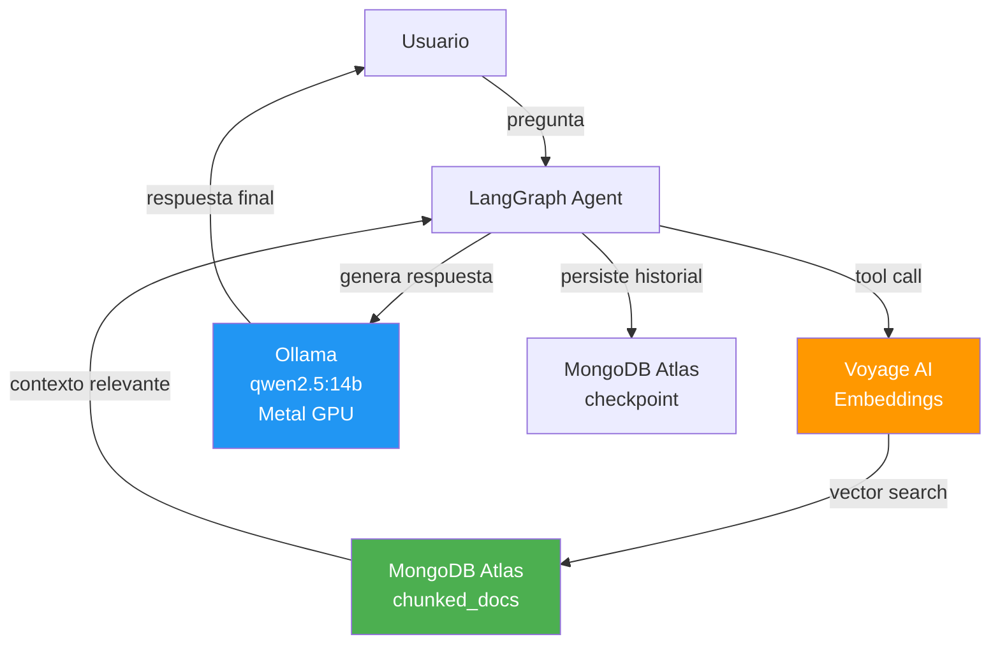
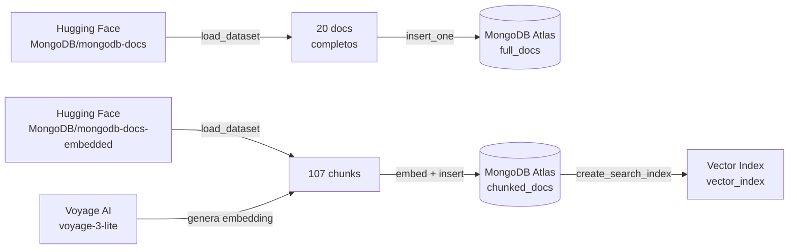
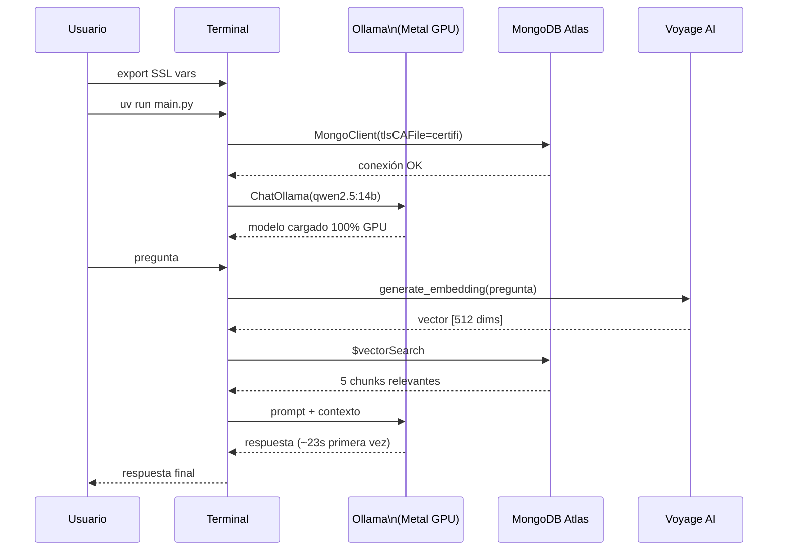

# Setup en macOS (Apple Silicon) — MongoDB RAG Agent

Guía para dejar funcionando el proyecto **Building AI Agents with MongoDB** en macOS con Apple Silicon (M1/M2/M3/M4), resolviendo los problemas de SSL, certificados Kaspersky y dependencias.

---

## Arquitectura del proyecto



> **Ventaja Apple Silicon:** Ollama detecta automáticamente el chip y usa el **Metal GPU framework**, corriendo el modelo completamente en GPU con memoria unificada. No se requiere configuración adicional.

---

## Prerrequisitos

| Herramienta | Versión recomendada | Notas |
|---|---|---|
| Python | 3.12.x | Gestionar con pyenv |
| pyenv | cualquiera | `brew install pyenv` |
| uv | última | Gestor de paquetes |
| Ollama | última | Nativo Apple Silicon |
| VS Code | última | Con extensión Python |

---

## Problema 1 — SSL con Kaspersky (Hugging Face y PyPI)

Kaspersky para Mac intercepta el tráfico HTTPS sustituyendo los certificados originales. Python, `uv` y `pip` no confían en estos certificados porque usan sus propios bundles TLS.

### Diagnóstico

```bash
curl -v https://huggingface.co 2>&1 | grep -E "issuer|subject"
# Mostrará:
# subject: CN=huggingface.co
# issuer: O=AO Kaspersky Lab; CN=Kaspersky Web Anti-Virus Certification Authority
```

### Solución — Exportar certificados del sistema macOS

macOS almacena el certificado de Kaspersky en el Keychain del sistema. Hay que exportarlo y distribuirlo a todas las herramientas que lo necesitan.

**1. Verificar que el certificado está en el Keychain:**
```bash
security find-certificate -c "Kaspersky" -a -p | openssl x509 -noout -subject -issuer
# Debe mostrar: O=AO Kaspersky Lab
```

**2. Exportar todos los certificados del sistema:**
```bash
security export -t certs -f pemseq -k /Library/Keychains/System.keychain -o ~/Desktop/system-certs.pem
security export -t certs -f pemseq -k ~/Library/Keychains/login.keychain-db -o ~/Desktop/login-certs.pem
cat ~/Desktop/login-certs.pem >> ~/Desktop/system-certs.pem
```

**3. Agregar al bundle de `certifi` (para Python/PyMongo/requests):**
```bash
cat ~/Desktop/system-certs.pem >> $(python -c "import certifi; print(certifi.where())")

# Verificar que quedó bien:
tail -3 $(python -c "import certifi; print(certifi.where())")
# Debe terminar con: -----END CERTIFICATE-----
```

**4. Definir variables de entorno antes de ejecutar** (necesario para Hugging Face/httpx):
```bash
export SSL_CERT_FILE=~/Desktop/system-certs.pem
export REQUESTS_CA_BUNDLE=~/Desktop/system-certs.pem
export CURL_CA_BUNDLE=~/Desktop/system-certs.pem
```

> ⚠️ **Importante:** El bundle de `certifi` se sobreescribe al actualizar el paquete. Si vuelve el error SSL, repetir el paso 3.

---

## Problema 2 — `uv` no puede conectarse a PyPI

`uv` tiene su propio bundle TLS estático y no lee `SSL_CERT_FILE`. El flag `--system-certs` tampoco es suficiente.

### Síntoma
```
error: Request failed after 3 retries
Caused by: invalid peer certificate: UnknownIssuer
```

### Solución

Usar `UV_SYSTEM_CERTS` y las variables de entorno SSL combinadas:

```bash
export SSL_CERT_FILE=~/Desktop/system-certs.pem
export UV_SYSTEM_CERTS=1
uv add <paquete>
```

Si `uv` sigue fallando, instalar directamente con `pip` dentro del `.venv`:

```bash
# uv no incluye pip en el .venv por defecto, habilitarlo primero:
uv run python -m ensurepip

# Instalar con pip del .venv:
uv run python -m pip install <paquete>==<version> --cert ~/Desktop/system-certs.pem
```

> ⚠️ **No usar `pip` global** (el de pyenv). Siempre usar `.venv/bin/pip` o `uv run python -m pip` para no contaminar el entorno global.

---

## Problema 3 — SSL con Kaspersky (MongoDB Atlas)

MongoDB Atlas rechaza el certificado sustituto de Kaspersky con `TLSV1_ALERT_INTERNAL_ERROR` en el puerto 27017.

### Solución en el código

Modificar **todas** las conexiones a MongoDB para usar `certifi` explícitamente:

```python
import certifi
from pymongo import MongoClient

# Antes:
mongodb_client = MongoClient(key_param.mongodb_uri)

# Después:
mongodb_client = MongoClient(
    key_param.mongodb_uri,
    tlsCAFile=certifi.where()
)
```

Esto aplica tanto a `data.py` como a `main.py`.

---

## Verificar datos existentes antes de ejecutar `data.py`

> ⚠️ **`data.py` no es idempotente.** MongoDB Atlas es cloud — los datos cargados desde Windows siguen disponibles en Mac. Verificar antes de ejecutar para no duplicar documentos ni consumir tokens de Voyage AI innecesariamente.

```bash
python -c "
from pymongo import MongoClient
import certifi, key_param
client = MongoClient(key_param.mongodb_uri, tlsCAFile=certifi.where())
db = client['ai_agents']
print('full_docs:', db['full_docs'].count_documents({}))
print('chunked_docs:', db['chunked_docs'].count_documents({}))
"
# Si muestra full_docs: 60 y chunked_docs: 113 → NO ejecutar data.py
```

---

## Carga de datos — `data.py` (solo si es necesario)



```bash
export SSL_CERT_FILE=~/Desktop/system-certs.pem
export REQUESTS_CA_BUNDLE=~/Desktop/system-certs.pem
uv run data.py
```

---

## Instalación del LLM local — Ollama

### Instalación

**1. Descargar desde [ollama.com](https://ollama.com)** el instalador para macOS y ejecutarlo.

**2. Descargar el modelo recomendado para Apple Silicon:**
```bash
ollama pull qwen2.5:14b
```

> `qwen2.5:14b` es la mejor relación calidad/velocidad en Apple Silicon. En M4 Max corre completamente en GPU (17 GB de memoria unificada).

**3. Verificar uso de GPU:**
```bash
# En una terminal, mientras corre una inferencia:
ollama ps
# Debe mostrar: qwen2.5:14b ... 17 GB ... 100% GPU
```

### Instalar integración con LangChain

```bash
uv run python -m ensurepip
uv run python -m pip install langchain-ollama==0.2.3 --cert ~/Desktop/system-certs.pem

# Verificar:
uv run python -c "from langchain_ollama import ChatOllama; print('✅ OK')"
```

### Modificar `main.py`

```python
# Reemplazar:
from langchain_openai import ChatOpenAI
# Por:
from langchain_ollama import ChatOllama

# Reemplazar:
llm = ChatOpenAI(openai_api_key=key_param.openai_api_key, temperature=0, model="gpt-4o")
# Por:
llm = ChatOllama(temperature=0, model="qwen2.5:14b")
```

---

## Flujo de ejecución final



---

## Script de inicio rápido

Agrega esto a tu `~/.zshrc` o ejecútalo cada vez que abras una nueva sesión de trabajo:

```bash
# ~/.zshrc o ejecutar manualmente al inicio de sesión
export SSL_CERT_FILE=~/Desktop/system-certs.pem
export REQUESTS_CA_BUNDLE=~/Desktop/system-certs.pem
export CURL_CA_BUNDLE=~/Desktop/system-certs.pem
export UV_SYSTEM_CERTS=1
```

Luego para ejecutar el proyecto:

```bash
cd <directorio-del-proyecto>
uv run main.py
```

---

## Comandos de verificación rápida

```bash
# Verificar Python
python --version  # debe ser 3.12.x

# Verificar certificado Kaspersky en Keychain
security find-certificate -c "Kaspersky" -a -p | openssl x509 -noout -subject

# Verificar datos en MongoDB Atlas
python -c "
from pymongo import MongoClient
import certifi, key_param
client = MongoClient(key_param.mongodb_uri, tlsCAFile=certifi.where())
db = client['ai_agents']
print('full_docs:', db['full_docs'].count_documents({}))
print('chunked_docs:', db['chunked_docs'].count_documents({}))
"

# Verificar Ollama y uso de GPU
ollama ps

# Verificar langchain-ollama
uv run python -c "from langchain_ollama import ChatOllama; print('OK')"

# Ejecutar el agente
uv run main.py
```

---

## Resumen de problemas y soluciones

| Problema | Causa | Solución |
|---|---|---|
| `SSL: CERTIFICATE_VERIFY_FAILED` (HuggingFace) | Kaspersky intercepta HTTPS | Exportar certs del sistema → agregar a certifi + `SSL_CERT_FILE` |
| `TLSV1_ALERT_INTERNAL_ERROR` (MongoDB) | Kaspersky intercepta TLS port 27017 | `tlsCAFile=certifi.where()` en MongoClient |
| `uv add` falla con `UnknownIssuer` | uv tiene TLS estático propio | `UV_SYSTEM_CERTS=1` o usar `uv run python -m pip install --cert` |
| `pip` instala en global en vez de `.venv` | Se usó `pip` del sistema | Usar siempre `uv run python -m pip install` |
| Conflicto de versiones `langchain-core` | `pip` instaló versión incompatible | Fijar versión: `langchain-ollama==0.2.3` |
| `insufficient_quota` (OpenAI) | Sin créditos en OpenAI | Reemplazar con Ollama + qwen2.5:14b |
| `ModuleNotFoundError: langchain_ollama` | Paquete no en `.venv` | `uv run python -m pip install langchain-ollama==0.2.3 --cert ~/Desktop/system-certs.pem` |
