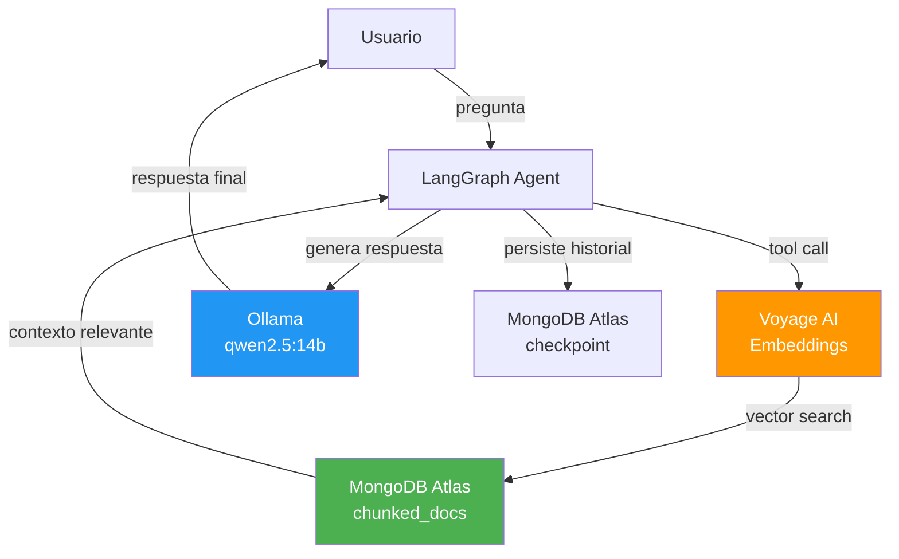
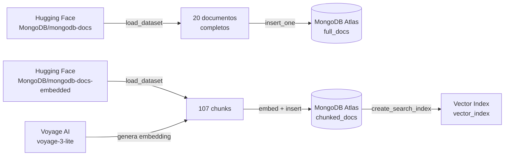
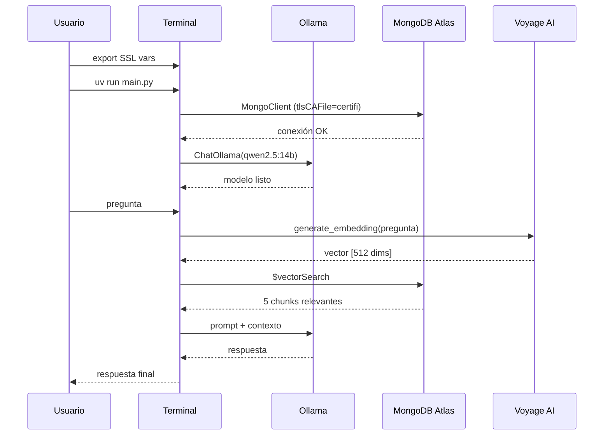

# Setup en Windows 11 — MongoDB RAG Agent

Guía para dejar funcionando el proyecto **Building AI Agents with MongoDB** en Windows 11, resolviendo los problemas de SSL, certificados y compatibilidad de versiones encontrados durante la instalación.

---

## Arquitectura del proyecto



---

## Prerrequisitos

| Herramienta | Versión recomendada | Notas |
|---|---|---|
| Python | 3.12.x | 3.14 es incompatible con LangChain |
| pyenv-win | cualquiera | Para gestionar versiones de Python |
| uv | última | Gestor de paquetes y entornos virtuales |
| Ollama | última | Para correr LLMs localmente |
| VS Code | última | Con extensión Python |

---

## Problema 1 — Incompatibilidad con Python 3.14

El proyecto venía configurado con `requires-python = ">=3.14"` en `pyproject.toml`, pero Python 3.14 es incompatible con el ecosistema LangChain/Pydantic actual.

### Solución

**1. Instalar Python 3.12 con pyenv:**
```powershell
pyenv install 3.12.9
cd <directorio-del-proyecto>
pyenv local 3.12.9
python --version
# Debe mostrar: Python 3.12.9
```

**2. Corregir `pyproject.toml`:**
```toml
# Cambiar:
requires-python = ">=3.14"

# Por:
requires-python = ">=3.12"
```

**3. Recrear el entorno virtual:**
```powershell
rmdir /s /q .venv
uv sync
```

---

## Problema 2 — SSL con Kaspersky (Hugging Face)

Kaspersky Antivirus intercepta el tráfico HTTPS y sustituye los certificados originales por los suyos propios. Python no confía en estos certificados porque usa su propio bundle (`certifi`), independiente del sistema operativo.

### Diagnóstico

```powershell
curl -v https://huggingface.co 2>&1 | grep -E "issuer|subject"
# Mostrará: issuer: O=AO Kaspersky Lab
```

### Solución

**1. Exportar certificados del sistema (incluye Kaspersky):**
```powershell
# En PowerShell como administrador
$cert = Get-ChildItem -Path Cert:\LocalMachine\Root | Where-Object { $_.Subject -like "*Kaspersky*" }
$cert | Export-Certificate -FilePath "$env:USERPROFILE\Desktop\kaspersky-cert.cer" -Type CERT
```

O desde la interfaz gráfica: **Certmgr.msc → Entidades de certificación raíz de confianza → Kaspersky → Exportar como .PEM**

**2. Agregar el certificado a `certifi`:**
```powershell
python -c "import certifi; print(certifi.where())"
# Copia la ruta y ejecuta:
Get-Content "$env:USERPROFILE\Desktop\kaspersky-cert.pem" | Add-Content "C:\ruta\al\bundle\cacert.pem"
```

**3. Definir variables de entorno antes de ejecutar:**
```powershell
$env:SSL_CERT_FILE = "$env:USERPROFILE\Desktop\system-certs.pem"
$env:REQUESTS_CA_BUNDLE = "$env:USERPROFILE\Desktop\system-certs.pem"
$env:CURL_CA_BUNDLE = "$env:USERPROFILE\Desktop\system-certs.pem"
```

**4. Agregar `data.py` a las excepciones de Kaspersky:**

Kaspersky → Configuración → Zona de confianza → Agregar `python.exe` y `data.py` como aplicaciones de confianza.

---

## Problema 3 — SSL con Kaspersky (MongoDB Atlas)

MongoDB Atlas usa TLS en el puerto 27017 y rechaza el certificado sustituto de Kaspersky con el error `TLSV1_ALERT_INTERNAL_ERROR`.

### Solución en el código

Modificar la conexión en `data.py` y `main.py` para usar `certifi` explícitamente:

```python
import certifi
from pymongo import MongoClient

# Antes:
mongodb_client = MongoClient(key_param.mongodb_uri)

# Después:
mongodb_client = MongoClient(
    key_param.mongodb_uri,
    tlsCAFile=certifi.where()
)
```

> **Nota:** Si el error persiste, solicitar a Infraestructura la exclusión de inspección SSL/TLS para `*.mongodb.net` en Kaspersky.

---

## Problema 4 — IP no autorizada en MongoDB Atlas

MongoDB Atlas requiere que la IP del cliente esté en la lista de acceso permitido.

### Solución

**1. Obtener la IP pública:**
```powershell
Invoke-WebRequest -Uri "https://api.ipify.org" -UseBasicParsing | Select-Object -ExpandProperty Content
```

**2. Agregar la IP en MongoDB Atlas:**

`cloud.mongodb.com → Security → Network Access → Add IP Address`

> Para desarrollo se puede usar `0.0.0.0/0` para permitir cualquier IP.

---

## Carga de datos — `data.py`

> ⚠️ **Ejecutar solo una vez.** Los datos se almacenan en MongoDB Atlas (cloud) y son accesibles desde cualquier equipo. Ejecutar nuevamente duplicará los documentos.



**Ejecutar con las variables de entorno SSL:**
```powershell
$env:SSL_CERT_FILE = "$env:USERPROFILE\Desktop\system-certs.pem"
$env:REQUESTS_CA_BUNDLE = "$env:USERPROFILE\Desktop\system-certs.pem"
uv run data.py
```

---

## Problema 5 — Rate limit de Voyage AI

Sin método de pago registrado, Voyage AI limita a **3 RPM y 10K TPM**.

### Solución

Agregar método de pago en [dashboard.voyageai.com](https://dashboard.voyageai.com). Los primeros 200M tokens de `voyage-3-lite` son gratuitos.

---

## Instalación del LLM local — Ollama

Se usa Ollama para correr el LLM localmente, evitando el costo y la dependencia de OpenAI.

**1. Descargar e instalar Ollama desde [ollama.com](https://ollama.com)**

**2. Descargar el modelo:**
```powershell
ollama pull qwen2.5:14b
```

**3. Verificar que está corriendo:**
```powershell
ollama serve
ollama ps
# Debe mostrar: qwen2.5:14b ... PROCESSOR ...
```

**4. Instalar la integración con LangChain:**
```powershell
.venv\Scripts\pip install langchain-ollama==0.2.3
```

**5. Modificar `main.py`:**

```python
# Reemplazar:
from langchain_openai import ChatOpenAI
# Por:
from langchain_ollama import ChatOllama

# Reemplazar:
llm = ChatOpenAI(openai_api_key=key_param.openai_api_key, temperature=0, model="gpt-4o")
# Por:
llm = ChatOllama(temperature=0, model="qwen2.5:14b")
```

---

## Flujo de ejecución final



---

## Comandos de verificación rápida

```powershell
# Verificar Python
python --version

# Verificar datos en MongoDB Atlas
python -c "
from pymongo import MongoClient
import certifi, key_param
client = MongoClient(key_param.mongodb_uri, tlsCAFile=certifi.where())
db = client['ai_agents']
print('full_docs:', db['full_docs'].count_documents({}))
print('chunked_docs:', db['chunked_docs'].count_documents({}))
"

# Verificar Ollama
ollama ps

# Ejecutar el agente
$env:SSL_CERT_FILE = "$env:USERPROFILE\Desktop\system-certs.pem"
$env:REQUESTS_CA_BUNDLE = "$env:USERPROFILE\Desktop\system-certs.pem"
uv run main.py
```

---

## Resumen de problemas y soluciones

| Problema | Causa | Solución |
|---|---|---|
| `TypeError: 'function' object is not subscriptable` | Python 3.14 incompatible con LangChain | Usar Python 3.12.x |
| `SSL: CERTIFICATE_VERIFY_FAILED` (HuggingFace) | Kaspersky intercepta HTTPS | Exportar cert Kaspersky → agregar a certifi |
| `TLSV1_ALERT_INTERNAL_ERROR` (MongoDB) | Kaspersky intercepta TLS port 27017 | `tlsCAFile=certifi.where()` + excepción en Kaspersky |
| `ServerSelectionTimeoutError` | IP no autorizada en Atlas | Agregar IP en Network Access de Atlas |
| `RateLimitError` (Voyage AI) | Sin método de pago | Agregar tarjeta en dashboard.voyageai.com |
| `insufficient_quota` (OpenAI) | Sin créditos en OpenAI | Reemplazar con Ollama + qwen2.5:14b |
| `ModuleNotFoundError: langchain_ollama` | Paquete no instalado en .venv | `.venv\Scripts\pip install langchain-ollama==0.2.3` |
